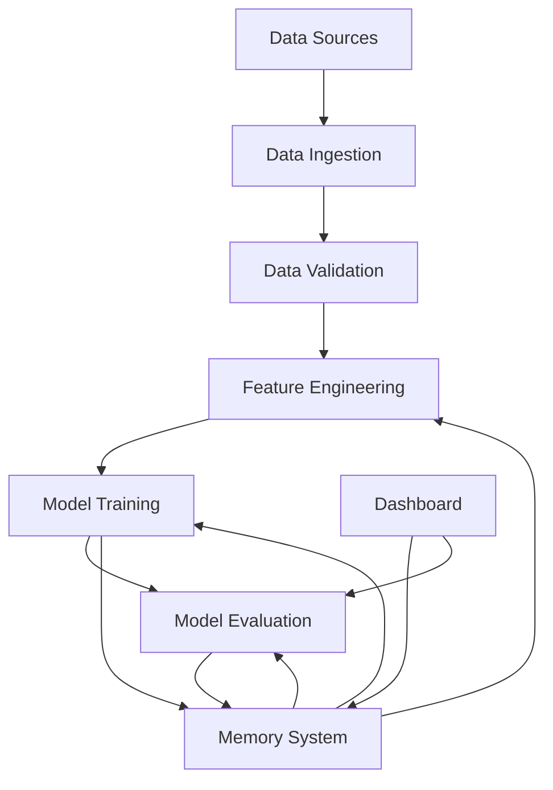
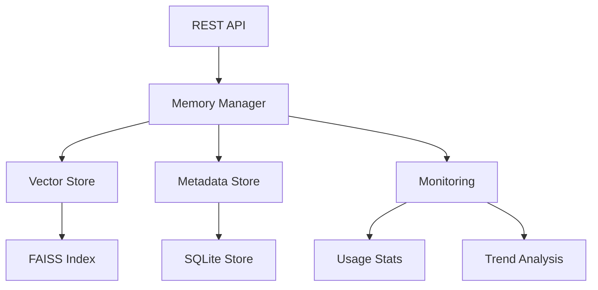
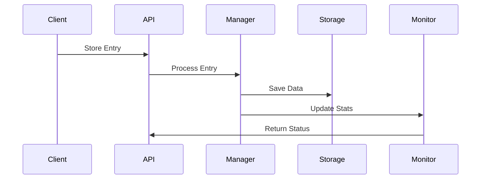
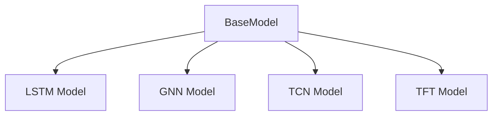
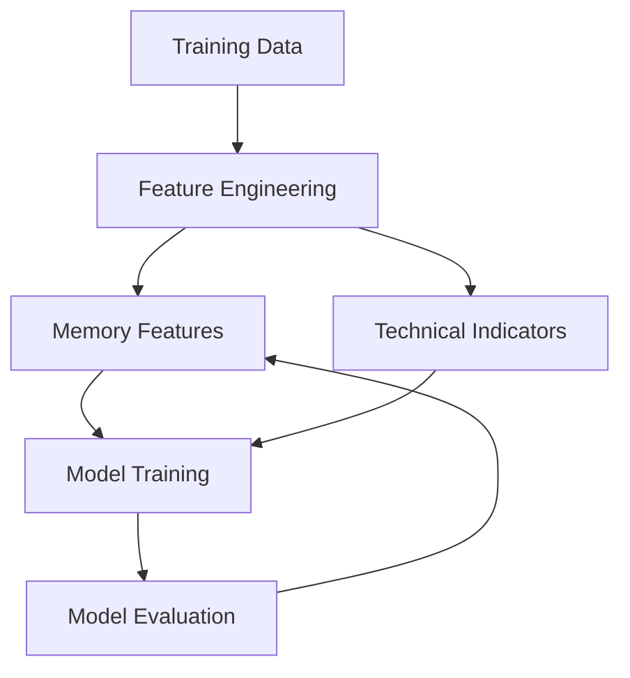
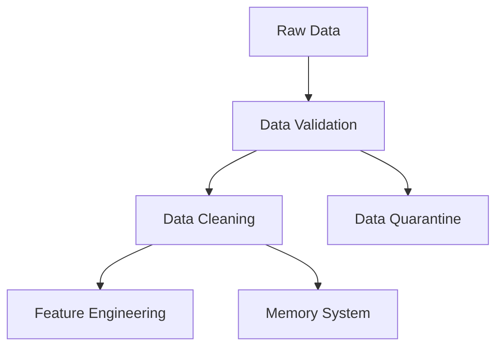
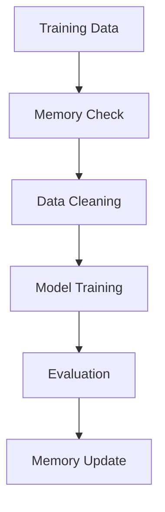
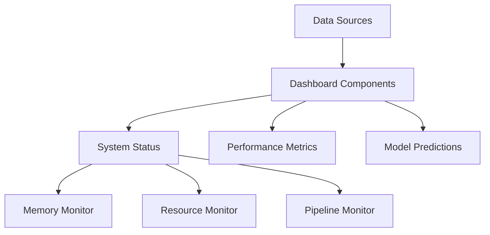
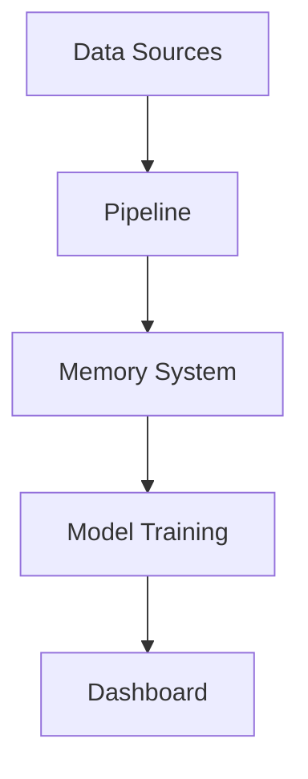
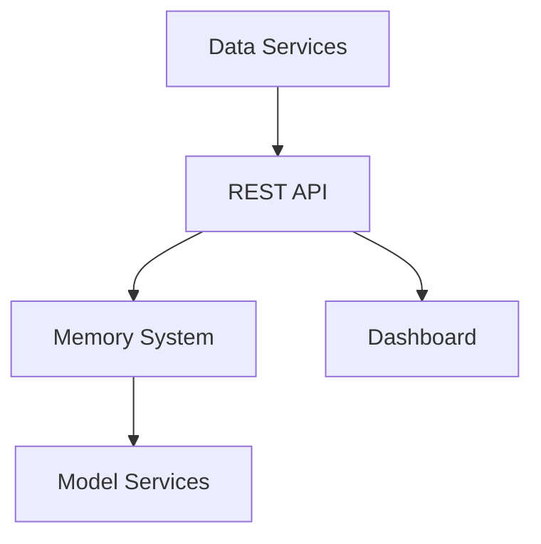

# FXorcist Architecture Guide

## System Overview

## Memory System Architecture

### Memory Layers

### Memory Tiers

1. Working Memory (WM)
   - Recent predictions and patterns
   - Fast access, limited size
   - Automatic consolidation

2. Long-Term Memory (LTM)
   - Historical patterns
   - Compressed representations
   - Indexed for efficient search

3. Episodic Memory (EM)
   - Significant market events
   - Anomaly records
   - Training feedback

### Data Flow

## Model Hierarchy

### Base Models

### Model Integration

## Pipeline Components

### Data Ingestion

### Feature Engineering

1. Technical Features
   - Price indicators
   - Volume metrics
   - Momentum signals

2. Memory Features
   - Historical patterns
   - Market regimes
   - Anomaly indicators

3. Combined Features
   - Feature fusion
   - Cross-validation
   - Importance ranking

### Training Pipeline

## System Components

### Dashboard Architecture

### Monitoring System

1. Resource Monitoring
   - CPU/Memory usage
   - Disk utilization
   - Network metrics

2. Memory Monitoring
   - Usage trends
   - Recall latency
   - Tier statistics

3. Pipeline Monitoring
   - Data freshness
   - Processing latency
   - Error rates

## Integration Points

### External Systems

### Internal Communication

1. Event System
   - Memory updates
   - Model training
   - System alerts

2. Data Flow
   - Raw data ingestion
   - Feature processing
   - Model predictions

3. Monitoring
   - Health checks
   - Performance metrics
   - Alert system

## Deployment Architecture

### Components

### Scaling Considerations

1. Memory System
   - Distributed storage
   - Load balancing
   - Cache layers

2. Model Training
   - Parallel processing
   - Resource allocation
   - Batch optimization

3. Dashboard
   - Component caching
   - Data streaming
   - Resource management

## Security Architecture

1. Data Protection
   - Input validation
   - Data encryption
   - Access control

2. Memory Security
   - Secure storage
   - Access logging
   - Data retention

3. API Security
   - Authentication
   - Rate limiting
   - Request validation

## Future Extensions

1. Distributed Memory
   - Federated storage
   - Sync protocols
   - Conflict resolution

2. Advanced Analytics
   - Pattern mining
   - Trend analysis
   - Anomaly detection

3. Enhanced Integration
   - External APIs
   - Data providers
   - Trading systems