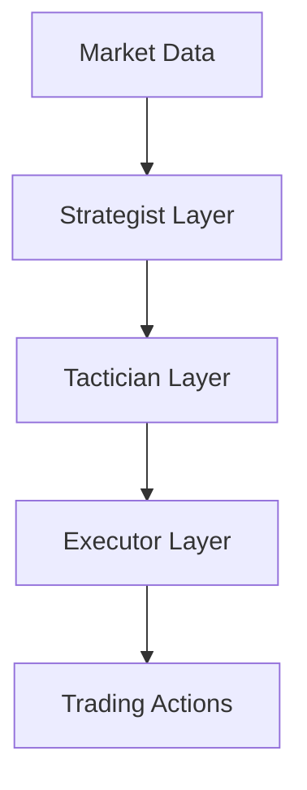

# Forex AI Development Process

## Local Deployment Preparation

### Prerequisites
```bash
# Create Python 3.9 environment
pyenv install 3.9.13
pyenv local 3.9.13

# Install core dependencies
pip install -r requirements.txt

# Initialize data directories
mkdir -p data/{raw,processed,models,reports}
```

### Data Ingestion Setup
1. Obtain API keys from:
   - OANDA (FX data)
   - Trading Economics (economic calendar)
   - Alpha Vantage (market sentiment)
2. Configure `.env` file:
   ```ini
   OANDA_API_KEY=your_api_key
   TRADING_ECONOMICS_KEY=your_key
   ALPHA_VANTAGE_KEY=your_key
   ```
3. Run initial data ingestion:
   ```bash
   python -m forex_ai_dashboard.data.ingestion
   ```

## Implementation Workflow

### Current Focus: Hierarchical RL Architecture


### Development Priorities
1. **Strategist Layer (GPT-4 Integration)**
   - Market regime analysis
   - Risk appetite assessment
2. **Tactician Layer (LSTM)**
   - Time horizon: 4-24 hours
   - Volatility-adjusted positioning
3. **Executor Layer (DQN)**
   - Order execution optimization
   - Slippage minimization

### Daily Development Protocol
1. Start development server:
   ```bash
   python dashboard/app.py --env=development
   ```
2. Run test suite before committing:
   ```bash
   pytest tests/ --cov=forex_ai_dashboard
   ```
3. Document new features in:
   - HOW_TO_USE.md
   - ARCHITECTURE.md (component interactions)
   - MODEL_CARDS.md (performance characteristics)

## Issue Tracking Guidelines

### Reporting Format
```markdown
## [Short Description]

**Module:** [module_name]
**Priority:** High/Medium/Low

### Expected Behavior
[Description]

### Actual Behavior
[Description]

### Reproduction Steps
1. 
2. 
3. 

### Environment
- OS: 
- Python Version: 
- Commit: 
```

### Severity Classification
| Level     | Response Time | Description               |
|-----------|---------------|---------------------------|
| Critical  | <2 hours      | System outage/crash       |
| High      | <24 hours     | Major functionality broken|
| Medium    | <72 hours     | Partial degradation       |
| Low       | Next sprint   | Cosmetic/minor issues     |

## Number Analysis Script

The `number_analysis_improved.py` script is used to analyze a list of numbers and identify patterns. It can be used to score numbers based on the rarity of patterns. The script takes a CSV, JSON, or TXT file as input and saves the results to `analysis_results.csv`.

To run the script, use the following command:

```bash
python number_analysis_improved.py
