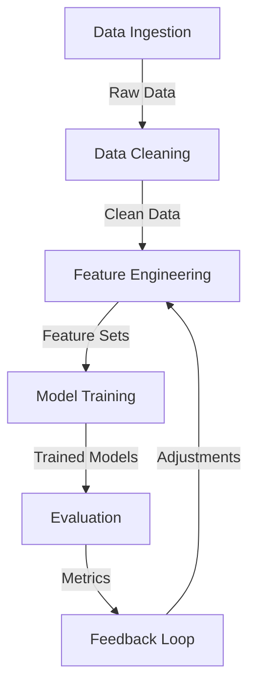

# Pipeline Alignment Documentation

## Current Pipeline Architecture



## Component Status & Alignments

### 1. Data Ingestion
**Status**: ✅ Operational
- Successfully fetching EURUSD data
- Pipeline runs completing successfully
- Data validation in place

**Required Alignments**:
- Add error recovery mechanisms
- Implement data quality checks
- Add support for additional currency pairs

### 2. Data Cleaning
**Status**: ✅ Operational
- Basic cleaning pipeline implemented
- Handling missing values
- Removing outliers

**Required Alignments**:
- Enhance outlier detection
- Add data quality metrics
- Implement automated validation

### 3. Feature Engineering
**Status**: 🔄 In Progress
- Basic features implemented
- Advanced features in development
- Version conflicts present

**Required Alignments**:
```python
# Feature versioning system
class FeatureVersion:
    def __init__(self):
        self.version = "1.0.0"
        self.dependencies = {}
        self.compatibility = {}

    def check_compatibility(self, model_version):
        return self.compatibility.get(model_version, False)
```

**Implementation Plan**:
1. Add feature versioning
2. Implement compatibility checks
3. Create feature registry
4. Add dependency tracking

### 4. Model Training
**Status**: ⚠️ Performance Issues
- Model tracking latency present
- Basic training pipeline operational
- Hierarchical system in place

**Required Alignments**:
```python
# Async logging implementation
async def log_model_metrics(metrics):
    async with aiofiles.open('model_metrics.log', 'a') as f:
        await f.write(json.dumps(metrics) + '\n')

# Batch processing
def process_model_batch(predictions, batch_size=100):
    return [process_chunk(predictions[i:i+batch_size]) 
            for i in range(0, len(predictions), batch_size)]
```

### 5. Evaluation
**Status**: 🔄 In Progress
- Basic metrics collection
- Performance monitoring
- Feedback system operational

**Required Alignments**:
- Enhance metrics collection
- Add performance benchmarks
- Implement continuous validation

## Integration Points

### 1. Feature Engineering ↔️ Model Training
```python
# Feature compatibility check
def verify_feature_compatibility(feature_set, model):
    version_registry = FeatureVersionRegistry()
    return version_registry.check_compatibility(
        feature_set.version,
        model.version
    )
```

### 2. Model Training ↔️ Evaluation
```python
# Metrics collection
def collect_model_metrics(model, predictions, actual):
    return {
        'accuracy': calculate_accuracy(predictions, actual),
        'latency': measure_prediction_latency(model),
        'feature_version': model.feature_version
    }
```

## Performance Optimizations

### 1. Async Processing
```python
# Async data processing
async def process_data_chunk(chunk):
    async with ProcessPoolExecutor() as pool:
        return await pool.map(process_single_item, chunk)
```

### 2. Memory Management
```python
# Memory-mapped file handling
def create_mmap_storage(filename, shape):
    return np.memmap(filename, dtype='float32', mode='w+', shape=shape)
```

### 3. Batch Processing
```python
# Optimized batch processing
def process_in_batches(data, batch_size=1000):
    return np.array_split(data, max(1, len(data)//batch_size))
```

## Testing Requirements

### 1. Unit Tests
```python
def test_feature_versioning():
    version = FeatureVersion()
    assert version.check_compatibility("1.0.0")
    assert not version.check_compatibility("0.9.0")
```

### 2. Integration Tests
```python
def test_pipeline_integration():
    data = load_test_data()
    features = engineer_features(data)
    model = train_model(features)
    assert model.feature_version == features.version
```

### 3. Performance Tests
```python
def test_processing_latency():
    start = time.time()
    process_batch(test_data)
    duration = time.time() - start
    assert duration < LATENCY_THRESHOLD
```

## Monitoring & Alerts

### 1. Performance Monitoring
- Track processing times
- Monitor memory usage
- Alert on latency spikes

### 2. Error Tracking
- Log all exceptions
- Track feature version conflicts
- Monitor data quality issues

### 3. Health Checks
- Pipeline component status
- Data flow monitoring
- System resource usage

## Success Criteria

1. **Performance**
   - Model prediction latency < 100ms
   - Feature engineering completion < 5min
   - Memory usage < 80% capacity

2. **Reliability**
   - Pipeline uptime > 99.9%
   - Error rate < 0.1%
   - Zero feature version conflicts

3. **Quality**
   - Test coverage > 90%
   - Data quality score > 0.95
   - All critical issues resolved

## Update Schedule

This document should be updated:
- Weekly for performance metrics
- Monthly for architecture reviews
- Immediately for critical issues

Last Updated: 2025-09-01
Next Review: 2025-09-08