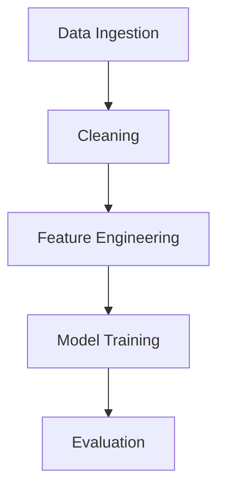

# Project State and Pipeline Alignment Documentation

## Current Project State

### Core Components Status

1. **Data Pipeline**
   - ✅ Data ingestion operational for EURUSD
   - ✅ Basic cleaning pipeline implemented
   - 🔄 Feature engineering pipeline in progress
   - ⚠️ Need to address feature versioning conflicts

2. **AI Architecture**
   - Hierarchical RL system with three layers:
     - Strategist Layer (GPT-4 Integration)
     - Tactician Layer (LSTM)
     - Executor Layer (DQN)
   - ⚠️ Model tracking experiencing latency issues

3. **Dashboard**
   - Basic visualization components implemented
   - ⚠️ Timezone handling needs improvement
   - Integration with real-time data streams pending

### Feature Engineering Progress

Currently implementing extensive feature set including:
- ✅ Lag features
- ✅ Rolling statistics
- ✅ Momentum/oscillators
- ✅ Volatility bands
- 🔄 Derived transforms
- 🔄 Session/external features
- ⏳ Wavelet denoising
- ⏳ Fractional differencing
- ⏳ Event-driven features

## Active Issues and Solutions

### High Priority

1. **Model Tracking Latency**
   - **Issue**: 350-500ms latency in model predictions
   - **Solution in Progress**:
     - Implementing async logging
     - Memory-mapped files for shared state
     - Batch processing for tracking events

2. **Feature Versioning Conflicts**
   - **Issue**: Mismatches during model version rollbacks
   - **Solution Plan**:
     - Adding feature schema versioning
     - Implementing compatibility checks
     - Creating feature version registry

### Lower Priority

1. **Dashboard Timezone Handling**
   - **Issue**: Inconsistent UTC conversion
   - **Solution**: Centralizing timezone management

## Pipeline Alignments

### Data Processing Pipeline

### Required Alignments

1. **Feature Engineering**
   - Implement feature version tracking
   - Add compatibility layers
   - Create feature dependency graph

2. **Model Training**
   - Optimize tracking system
   - Implement async logging
   - Add batch processing

3. **Evaluation**
   - Enhance metrics collection
   - Add performance benchmarks
   - Implement automated testing

## Next Steps

### Immediate Actions (Next 2 Weeks)

1. **Feature Engineering**
   - Complete wavelet denoising implementation
   - Add fractional differencing
   - Implement event-driven features

2. **Performance Optimization**
   - Implement async logging for model tracking
   - Add memory-mapped file support
   - Optimize batch processing

3. **Infrastructure**
   - Add feature versioning system
   - Implement compatibility checks
   - Update pipeline configuration

### Medium Term (1-2 Months)

1. **System Integration**
   - Complete hierarchical RL implementation
   - Enhance model communication
   - Optimize data flow

2. **Testing & Validation**
   - Expand test coverage
   - Add performance benchmarks
   - Implement continuous validation

### Long Term (3+ Months)

1. **Scale & Optimize**
   - Distributed training support
   - Advanced caching mechanisms
   - Performance optimization

2. **Feature Enhancement**
   - Advanced feature selection
   - Automated feature discovery
   - Dynamic feature adaptation

## Success Metrics

- Model prediction latency < 100ms
- Feature version conflicts resolved
- Test coverage > 90%
- All critical issues addressed
- Pipeline stability achieved

## Documentation Updates

Regular updates needed for:
- Feature engineering documentation
- Architecture diagrams
- Performance metrics
- Issue tracking
- Development roadmap

This document should be updated weekly to reflect current project state and progress.